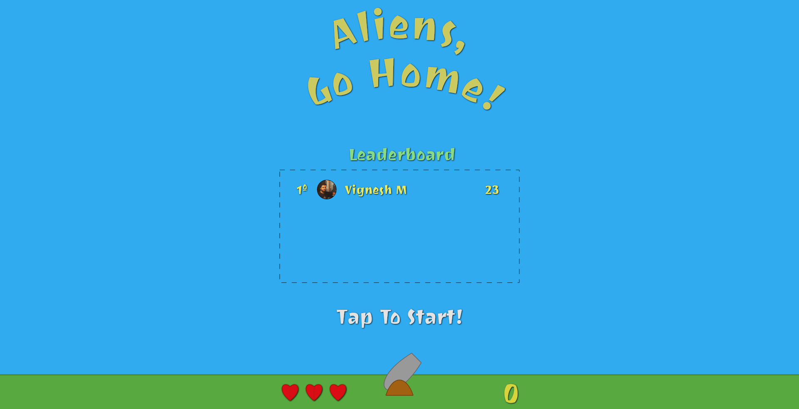

# Aliens Vs Cannons

[](https://github.com/vigzmv/aliens_vs_cannons)
&nbsp;&nbsp;
[](https://github.com/vigzmv/aliens_vs_cannons)
&nbsp;&nbsp;
[](https://github.com/vigzmv/aliens_vs_cannons)

## Shoot them All!!

Thanks to [Brunos Krebs](https://twitter.com/brunoskrebs) for this amazing [guide](https://auth0.com/blog/developing-games-with-react-redux-and-svg-part-1/) for this project.

Built Using:

* React
* Redux
* Redis
* SVG
* Auth0
* Node & Express
* Web Sockets

## Live Demo

Check out the live demo
[Here: vigneshm.com/aliens_vs_cannons](https://vigneshm.com/aliens_vs_cannons/)

<hr>

## Screenshots



<hr>

## Run the App

### Front End

#### Install the dependencies:

```sh
npm install
```

#### Run the development server:

```sh
npm start
```

### Server

#### Install the dependencies:

```sh
cd server && npm install
```

#### Run the development server:

```sh
npm run server
```

Runs the app in the development mode.<br> Open
[http://localhost:3000](http://localhost:3000) to view it in the browser.

The page will reload if you make edits.<br> You will also see any lint errors in
the console.

#### Redis

Install and start redis-server. Redis is used to cache leaderboard and player data.


### Build the app for production:

```sh
npm build
```

Builds the app for production to the `build` folder.<br> It correctly bundles
React in production mode and optimizes the build for the best performance.

The build is minified and the filenames include the hashes

<hr>

## Contribute ?

* Fork the repository
* Commit your changes
* Submit a pull request

## Licence

[MIT Licence](https://github.com/vigzmv/aliens_vs_cannons/blob/master/LICENSE) ©
[Vignesh M](https://vigneshm.com)
